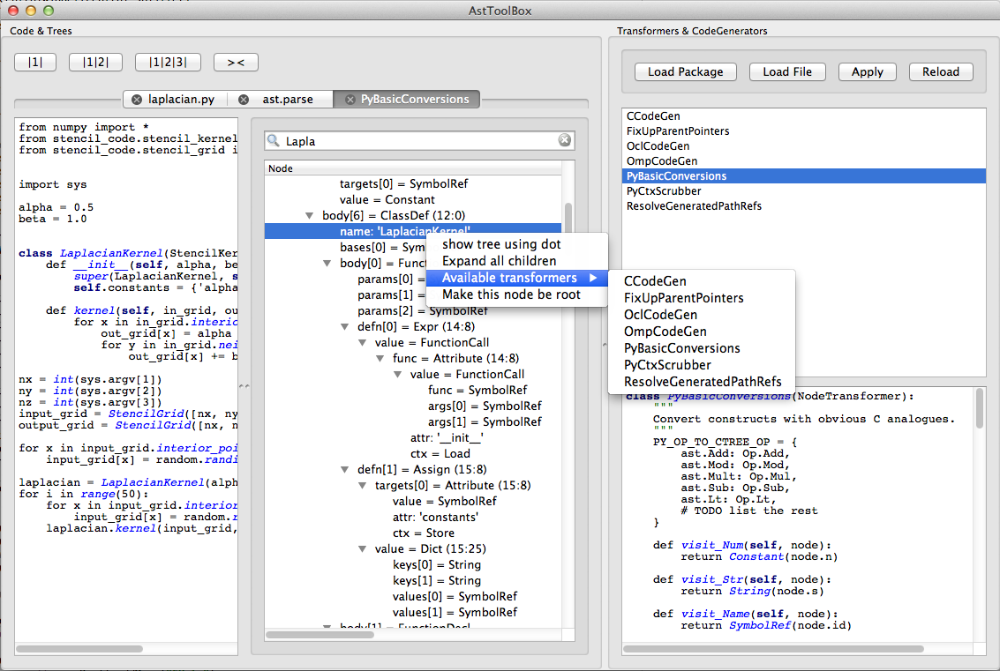

astviewer
=========

Python Abstract Syntax Tree Tool built on PySide
It can show a GUI tree representation of an AST.  Any tree or node can be
used to produce a new tree by the application of ast.NodeTransformer

This tool was derived from `AstViewer <https://github.com/titusjan/astviewer>`_



Usage:
======
*	Command line example:
	
		%> pyastviewer myprog.py
	
*	Examples to use from within Python:

	```python
	>>> from astviewer import view
	>>> view(file_name='myprog.py', width=800, height=600)
	>>> view(source_code = 'a + 3', mode='eval')
	```

#### Further links:

The `Green Tree Snakes documentation on ASTs<http://greentreesnakes.readthedocs.org/>`_ is available
for those who find the `Python ast module documentation<http://docs.python.org/3/library/ast>`_ too brief.

Installation:
=============
1.	Install PySide:
	`<http://qt-project.org/wiki/Category:LanguageBindings::PySide>`_

2.	Run the installer:

		%> sudo python setup.py install

